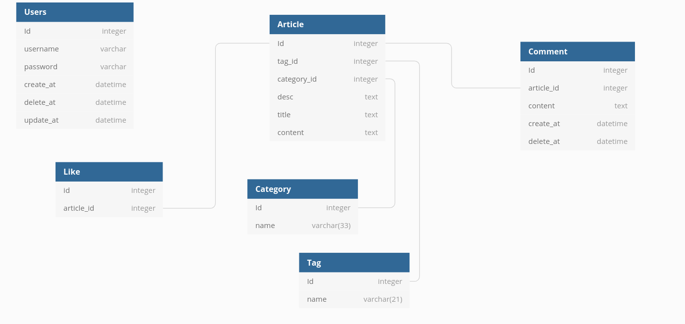

# go-web-blog
基于gin+gorm框架实现的一个博客后台部分
## api文档
#### 公共接口
- [1.用户登录](#用户登录)
- [2.查询目录列表](#查询目录列表)
- [3.查询文章列表](#查询文章列表)
- [4.查询单个文章](#查询单个文章)
- [5.查询单个目录](#查询单个目录)
#### 私有类接口
##### 用户类
- [1.编辑用户信息](#编辑用户信息)
#### 文章类
- [1.添加文章](#添加文章)
- [2.编辑文章](#编辑文章)
- [3.删除文章](#删除文章)
#### 分类类
- [1.添加目录](#添加目录)
- [2.编辑目录](#编辑目录)
- [3.删除目录](#删除目录)
#### 上传类
- [1.上传文件](#上传文件)

<a href = "https://dbdiagram.io/d/6117e5532ecb310fc3cb6f68">传送门</a>

